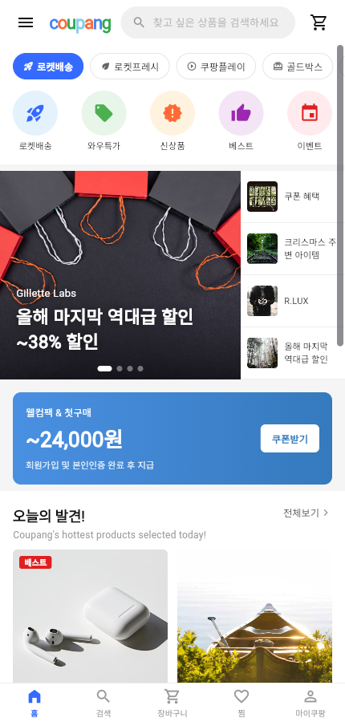
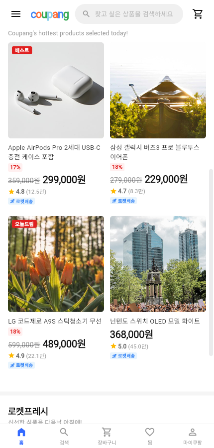
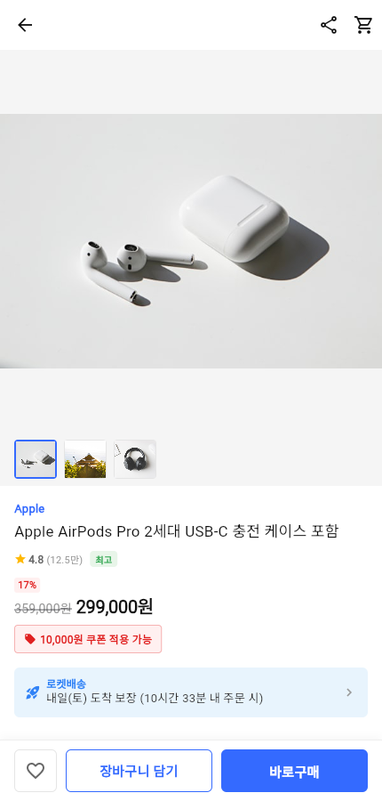
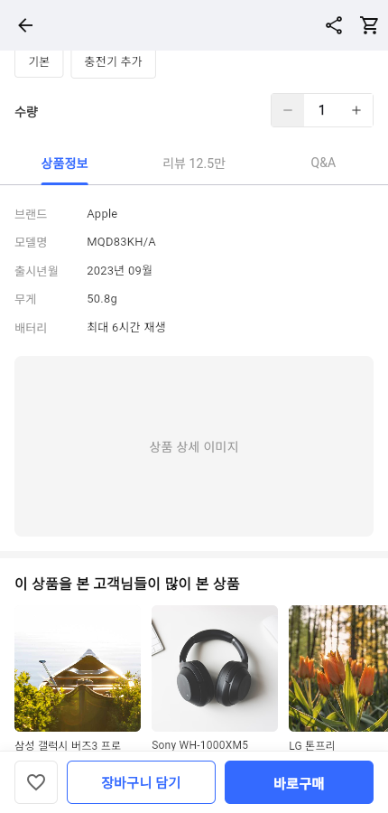
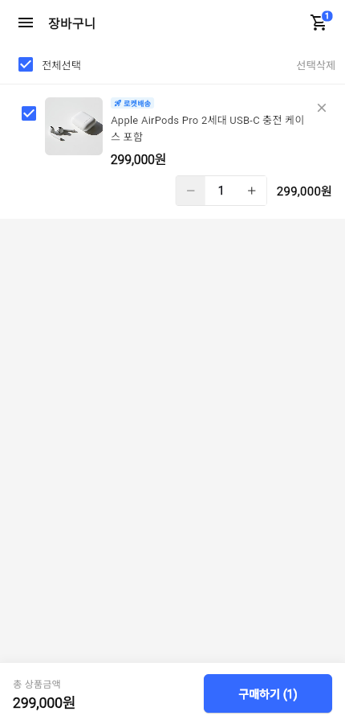
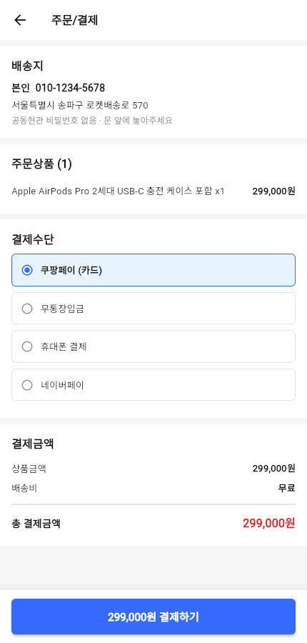
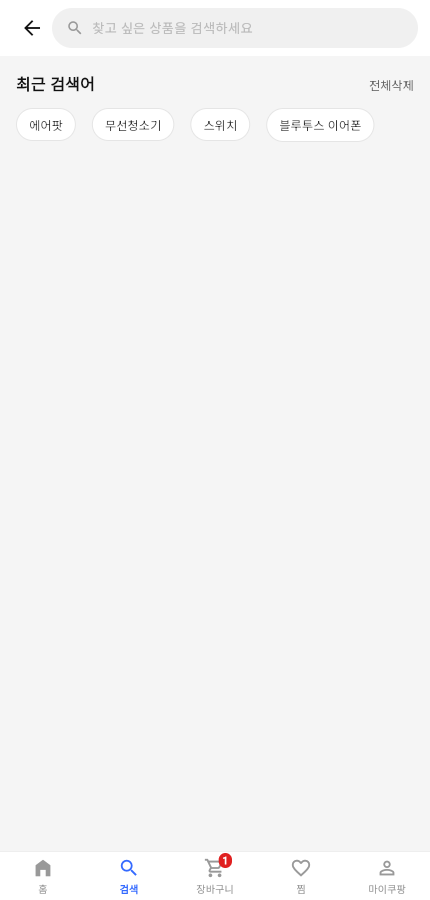
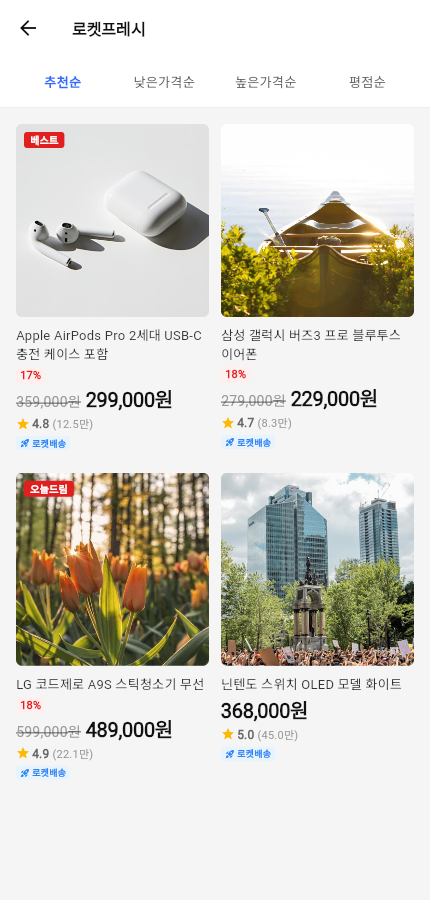
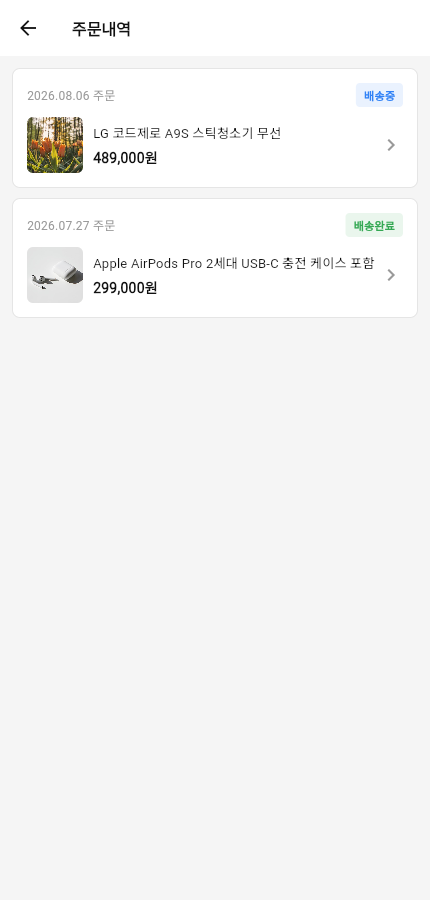
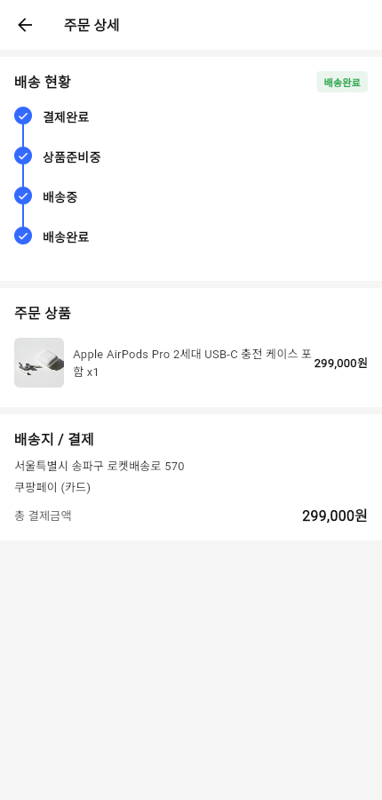

# Coupang-style Shopping App (Flutter)

A Flutter e-commerce app UI built with Clean Architecture. The visual style —
rocket-delivery badges, red/blue accents, category tabs, product cards — is
**inspired by the Coupang app**, recreated from scratch as an original
learning/demo project. It is not affiliated with, endorsed by, or built from
Coupang's source code or assets; all copy, demo data, and layout code here
are original.

## Getting started

```bash
flutter pub get
flutter run -d chrome     # or any connected device
```

## App flow

The screenshots below were captured end-to-end with a headless browser,
walking through the app the way a user would: browse the home feed, open a
product, add it to the cart, check out, then look around search, wishlist,
login, and order history.

| Step | Screen | Preview |
|---|---|---|
| 1 | **Home** — category tabs, hero banner, product feed |  |
| 2 | **Home (scrolled)** — product grid |  |
| 3 | **Product detail** — gallery, price, options |  |
| 4 | **Product detail — reviews tab** — independently-scrolling tabs linked to the collapsing header |  |
| 5 | **Cart** — quantity steppers, selection, running total |  |
| 6 | **Checkout** — address, payment method, order summary (mock) |  |
| 7 | **Search** — recent searches, results grid |  |
| 8 | **Category listing** — sort by recommended/price/rating |  |
| 9 | **Wishlist** — saved items, empty state |  |
| 10 | **My Coupang (profile)** — account menu |  |
| 11 | **Login** — mock auth |  |
| 12 | **Order history** — status chips |  |
| 13 | **Order detail** — delivery tracking stepper |  |

Bottom navigation ties Home / Search / Cart / Wishlist / My Coupang together
as five top-level tabs (`lib/app/root_shell.dart`).

## Architecture

Each feature under `lib/features/` follows the same Clean Architecture
layering:

```
feature/
  domain/
    entities/        # plain data classes
    repositories/     # abstract interfaces — the only thing usecases depend on
    usecases/          # one callable class per use case
  data/
    models/            # (de)serializable data-layer models
    repositories/       # in-memory "Demo" implementations — no real backend
  presentation/
    controllers/         # ChangeNotifier / Riverpod Notifier state holders
    pages/                 # screens (ConsumerWidget / ConsumerStatefulWidget)
    widgets/                 # feature-specific UI pieces
```

`auth`, `cart`, `home`, `orders`, `product`, and `wishlist` all have a
`domain/repositories/` interface with a matching `Demo*Repository`
implementation in `data/repositories/` — presentation code depends on the
interface (via a usecase), never on the concrete `Demo*` class directly.
`search` reuses `product`'s `ProductRepository` interface rather than
duplicating one.

All repositories are in-memory (`Demo*Repository`, each a `ChangeNotifier`)
so the app runs fully offline with no backend — cart, wishlist, auth, and
orders all persist only for the current session.

### Dependency injection & state — Riverpod

Wiring is centralized in `lib/core/providers/`:

- `repository_providers.dart` — exposes each `Demo*Repository` singleton as
  a `Provider`/`ChangeNotifierProvider`. This is the single seam where a
  concrete implementation is chosen; swapping `DemoCartRepository` for a
  real API-backed one later only touches this file.
- `usecase_providers.dart` — exposes every usecase as a `Provider` that
  reads its repository from the providers above.

Pages are `ConsumerWidget`/`ConsumerStatefulWidget` and pull what they need
with `ref.read(xUseCaseProvider)` (actions) or `ref.watch(xRepositoryProvider)`
(reactive lists — cart items, wishlist, orders re-render automatically on
change, replacing manual `ListenableBuilder` wiring). Search and category
sort state, which used to be raw `setState` fields, now live in
`search_notifier.dart` / `category_sort_notifier.dart` as `Notifier`s so
that state is inspectable/testable the same way as everything else.
`main.dart` wraps the app in a single `ProviderScope`.

### Tests

`test/widget_test.dart` covers the app's root smoke test. Coverage of the
usecases/repositories is still thin — the interfaces exist specifically so
unit tests can fake a repository and exercise a usecase in isolation; adding
that per-usecase suite is a natural next step, not yet done exhaustively.

## Reusable widget library

The shared UI kit was split out of two large files into one-widget-per-file
modules so individual pieces can be copy-pasted into other Flutter projects
without dragging the whole app along. Each file only imports what it
actually needs (Flutter, the theme tokens, and any sibling widget it
depends on).

**`lib/core/widgets/cp/`** — general-purpose UI kit:

| File | Widget |
|---|---|
| `cp_header.dart` | App bar: menu, logo, search bar, cart badge |
| `cp_search_bar.dart` | Search input pill |
| `cp_bottom_nav.dart` | 5-tab bottom navigation with cart badge |
| `cp_app_drawer.dart` | Slide-out menu (categories, quick links) |
| `cp_product_card.dart` | Grid product card (image, price, rating, badges) |
| `cp_horizontal_product_card.dart` | Horizontal scroll product card |
| `cp_price.dart` | Price + strikethrough + discount % |
| `cp_rating.dart` | Star rating + review count |
| `cp_chip.dart` | Filter/category chip |
| `cp_coupon_banner.dart` | Promo banner strip |
| `cp_section_header.dart` | "See all" section title row |
| `cp_rocket_badge.dart` / `cp_discount_badge.dart` | Small status badges |
| `cp_image.dart` | Renders `assets/...` as `Image.asset`, anything else as `Image.network`, with a shared error fallback |
| `coupang_logo.dart` / `category_button.dart` | Branding + menu icon |

**`lib/features/product/presentation/widgets/cp/`** — product-detail-specific:

| File | Widget |
|---|---|
| `cp_image_gallery.dart` | Swipeable product image gallery + thumbnails |
| `cp_delivery_info.dart` | Rocket delivery estimate banner |
| `cp_option_selector.dart` / `cp_quantity_selector.dart` | Variant + qty pickers |
| `cp_action_bar.dart` | Sticky bottom wishlist/add-to-cart/buy-now bar |
| `cp_related_carousel.dart` / `related_item.dart` | "Customers also viewed" carousel |
| `cp_review_summary.dart` / `cp_review_card.dart` / `cp_review_gallery.dart` / `cp_review_filter_bar.dart` | Review section pieces |
| `info_row.dart` | Label/value spec row |

Both `core/widgets/coupang_widgets.dart` and
`features/product/presentation/widgets/product_widgets.dart` are now thin
barrel files (`export 'cp/...'`), so existing imports elsewhere in the app
keep working unchanged.

## Images

Demo imagery is bundled locally under `assets/images/` (registered in
`pubspec.yaml`) instead of being fetched live, so the UI never breaks from a
dead external link. `CpImage` picks `Image.asset` vs `Image.network`
automatically based on the path.

## Notes

- Product review content and photos in the demo review section are
  illustrative sample data for the review UI, not scraped from any live
  service.
- This is a portfolio/learning project. It does not connect to any real
  payment, shipping, or account system.
